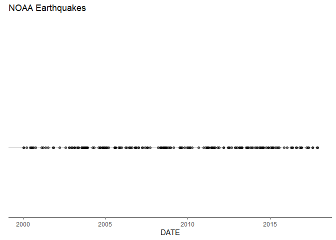

<!-- README.md is generated from README.Rmd. Please edit that file -->

# earthquakevisuals

<!-- badges: start -->

[](https://github.com/renesiodlaczek/earthquakevisuals/actions/workflows/R-CMD-check.yaml)
<!-- badges: end -->

The goal of earthquakevisuals is to …

## Installation

You can install the development version of earthquakevisuals from
[GitHub](https://github.com/) with:

``` r
# install.packages("pak")
pak::pak("renesiodlaczek/earthquakevisuals")
```

## Example

This is a basic example which shows you how to solve a common problem:

``` r
library(earthquakevisuals)
## basic example code
```

What is special about using `README.Rmd` instead of just `README.md`?
You can include R chunks like so:

``` r
summary(cars)
#>      speed           dist       
#>  Min.   : 4.0   Min.   :  2.00  
#>  1st Qu.:12.0   1st Qu.: 26.00  
#>  Median :15.0   Median : 36.00  
#>  Mean   :15.4   Mean   : 42.98  
#>  3rd Qu.:19.0   3rd Qu.: 56.00  
#>  Max.   :25.0   Max.   :120.00
```

You’ll still need to render `README.Rmd` regularly, to keep `README.md`
up-to-date. `devtools::build_readme()` is handy for this.

You can also embed plots, for example:

``` r
library(earthquakevisuals)
library(dplyr)
#> 
#> Attache Paket: 'dplyr'
#> Die folgenden Objekte sind maskiert von 'package:stats':
#> 
#>     filter, lag
#> Die folgenden Objekte sind maskiert von 'package:base':
#> 
#>     intersect, setdiff, setequal, union
library(ggplot2)
library(lubridate)
#> 
#> Attache Paket: 'lubridate'
#> Die folgenden Objekte sind maskiert von 'package:base':
#> 
#>     date, intersect, setdiff, union

data <- noaa_earthquakes |> 
    eq_clean_data() |>
    eq_location_clean()

data |> 
    dplyr::filter(country %in% c("ALASKA", "CHINA", "JAPAN")) |> 
    ggplot(aes(date)) +
    geom_timeline(xmin = as.Date("2000-01-01"), 
                  xmax = as.Date("2018-01-01")
                  ) +
    theme_classic() +
    theme(axis.line.y = element_blank(), 
          axis.ticks.y = element_blank(), 
          axis.text.y = element_blank()
          ) +
    labs(x = "DATE", 
         y = element_blank(), 
         title = "NOAA Earthquakes") +
    ylim(0.5, 2)
```



In that case, don’t forget to commit and push the resulting figure
files, so they display on GitHub and CRAN.
