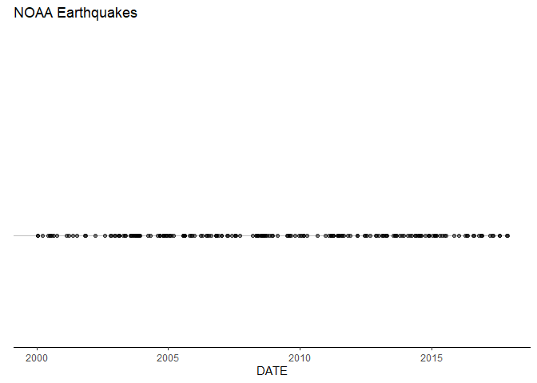
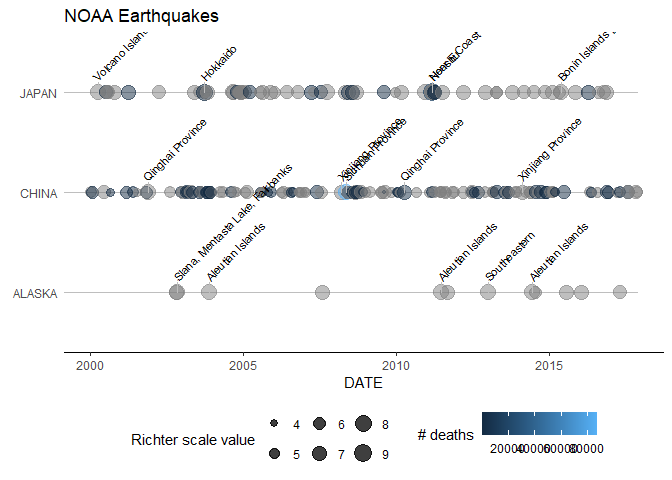
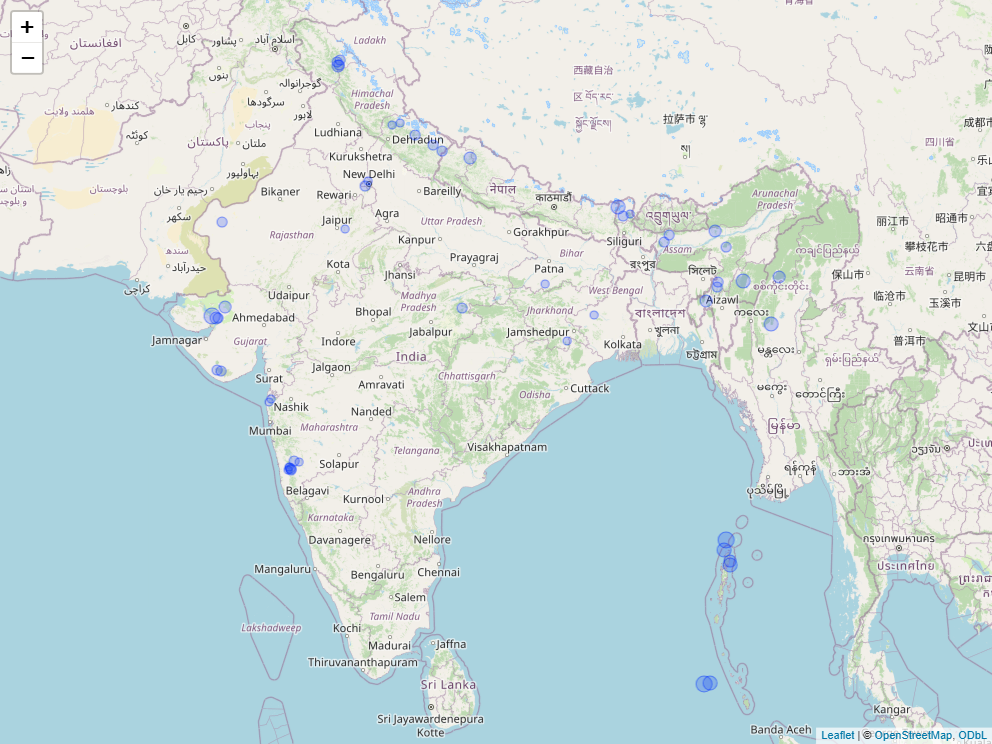

<!-- README.md is generated from README.Rmd. Please edit that file -->

# earthquakevisuals

<!-- badges: start -->

[](https://github.com/renesiodlaczek/earthquakevisuals/actions/workflows/R-CMD-check.yaml)
<!-- badges: end -->

The goal of earthquakevisuals is to provide custom visualizations to
analyze the earthquake data collected by the National Oceanographic and
Atmospheric Administration (NOAA). The package includes the data itself,
some preprocessing functions and some visualization functions that are
built on top of the ggplot2 and leaflet packages.

## Installation

You can install the development version of earthquakevisuals from
[GitHub](https://github.com/) with:

``` r
# install.packages("pak")
pak::pak("renesiodlaczek/earthquakevisuals")
```

## Setup

After installing the package the required packages must be loaded.

``` r
library(earthquakevisuals)
library(ggplot2)
```

The data is stored under the name `noaa_earthquakes`. It contains
observations form 2150 B.C. up until 2025. To be able to use it properly
some preprocessing steps are required bevorehand. For this purpose the
two functions `eq_clean_data()` and `eq_location_clean()` can be used.
Among others the former creates a date column and the latter separates
the country name and the location name into distinct columns.

``` r
data <- noaa_earthquakes |> 
    eq_clean_data() |>
    eq_location_clean()
```

## Ggplot2 dotplots

Once this is done the first visualization can be created. The package
contains the custom ggplot2 geom `geom_timeline()` which creates a
horizontal dotplot. It also provides the possibility to filter the data
in the geom itself via the parameters `xmin` and `xmax`.

``` r
data |> 
    subset(country %in% c("ALASKA", "CHINA", "JAPAN")) |> 
    ggplot(aes(date)) +
    geom_timeline(xmin = as.Date("2000-01-01"), 
                  xmax = as.Date("2018-01-01")
                  ) +
    theme_classic() +
    theme(axis.line.y = element_blank(), 
          axis.ticks.y = element_blank(), 
          axis.text.y = element_blank()
          ) +
    labs(x = "DATE", 
         y = element_blank(), 
         title = "NOAA Earthquakes") +
    ylim(0.5, 2)
```



But `geom_timeline()` allows for much more customization. E. g. you can
give a `y aesthetic` to split the dotplots into different groups. You
can also specify size and color to include more dimensions. Lastly, the
`geom_timeline_label()` function can be used to add a label to each
earthquake. Via the parameter `n_max` only the biggest earthquakes are
labelled according to the `size aesthetic`.

``` r
data |> 
    subset(country %in% c("ALASKA", "CHINA", "JAPAN")) |> 
    ggplot(aes(date, country, size = mag, color = total_deaths)) +
    geom_timeline(xmin = as.Date("2000-01-01"), 
                  xmax = as.Date("2018-01-01")
                  ) +
    geom_timeline_label(aes(label = location_name),
                        xmin = as.Date("2000-01-01"), 
                        xmax = as.Date("2018-01-01"),
                        n_max = 5
                        ) +
    theme_classic() +
    theme(axis.line.y = element_blank(),
          axis.ticks.y = element_blank(),
          legend.position = "bottom"
          ) +
    scale_size_continuous(name = "Richter scale value") +
    scale_color_continuous(name = "# deaths") +
    labs(x = "DATE", 
         y = element_blank(), 
         title = "NOAA Earthquakes")
```



## Leaflet maps

The function `eq_map()` is useful when one wants to display the
earthquakes on a map. The parameter `annot_col` steers which column is
used for labelling the individual earthquakes.

``` r
data |> 
    subset(country == "INDIA" & date >= as.Date("2000-01-01")) |>
    eq_map(annot_col = "date")
```



To have a label with more information the function `eq_create_label()`
can be used to generate a HTML formatted column with information about
an earthquake’s location, its magnitude and the associated number of
deaths. The newly created column can serve as an input for the
`eq_map()` function.

``` r
data |> 
    transform(popup_text = eq_create_label(data)) |> 
    subset(country == "INDIA" & date >= as.Date("2000-01-01")) |> 
    eq_map(annot_col = "popup_text")
```


